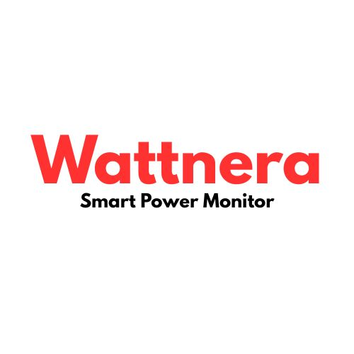
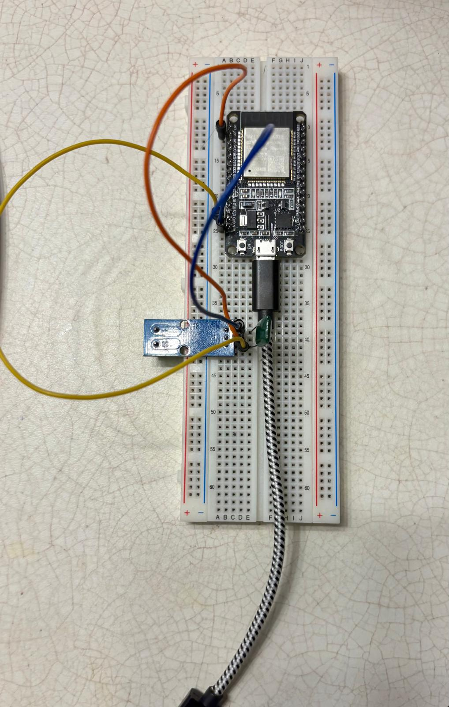
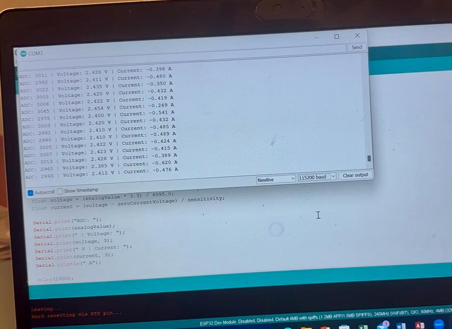
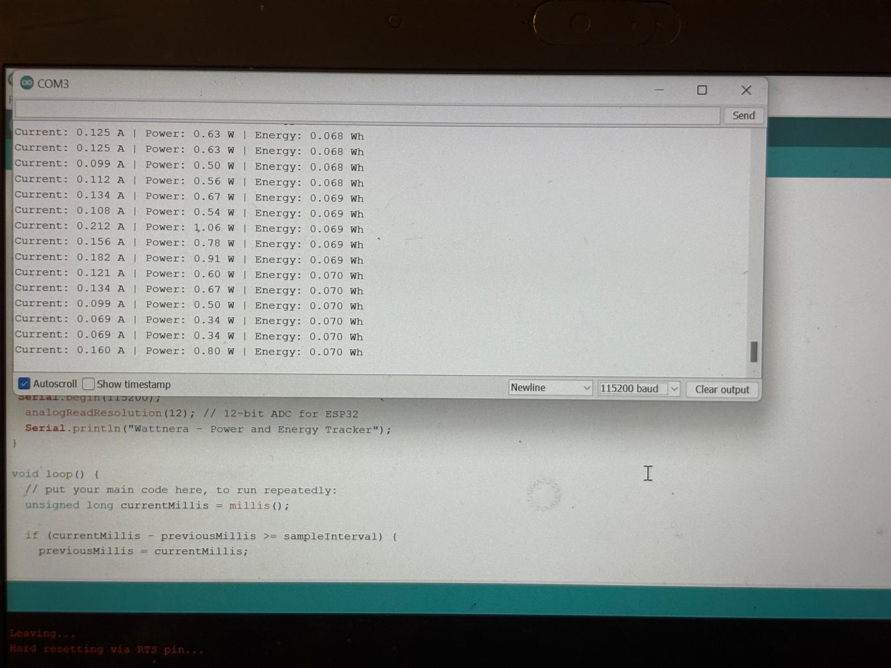

  

# Wattnera – Smart Power Monitoring System

**Wattnera** is a real-time power monitoring system built using an **ESP32 microcontroller** and an **ACS712 current sensor**. It measures electrical current, calculates power usage, tracks energy consumption and outputs data via Serial Monitor., diagnostics. This project was designed to explore embedded systems and DIY IoT device development. Future upgrades include OLED display integartion and smart load control.

---

#Project Versions

### Version 1 - Sensor Test
- Basic Current Sensing with ACS712
- Real-time current + voltage output to Serial Monitor

### Version 2 - Power _ Energy Tracking
- Calculates power using assumed voltge
- Accumulates energy in Wh overtime
- Outputs displayed in Serial Monitor

> Next version: OLED screen display + optimal Wi-Fi logging

---
## Features
- Real-time current sensing with ACS712 sensor
- Microcontroller-based system (ESP32)
- Serial Monitor output for live readings
- Power and energy tracking
- Optional Wi-Fi integration to log data remotely (Google Sheets or dashboard)
- Compact final version soldered on perfboard
- Managed with Trello & documented step-by-step

---

## Components
- ESP32 Dev Board (Micro USB)
- ACS712 Current Sensor (5A or 30A)
- Breadboard + Jumper Wires
- USB Cable
- (Optional) Solderable Perfboard for final version

---

## Project Images

---

## Live Demo Recordings

- [Wattnera v1 live output](https://drive.google.com/file/d/1twS5vsQ2nD6hKfE68O8bmMtsV8rj7o_a/view?usp=sharing)
- [Wattnera v2 Power and Energy Tracking Demo](https://drive.google.com/file/d/1IC7PGGKYFs9BFWkgxjqUBHS1xizZjeJ5/view?usp=sharing)

---

## How it Works

Wattnera uses an ACS712 current sensor and an ESP32 to monitor real-time current, estimate power, and track energy usage over time. Here’s a simplified breakdown of how it functions:

The ACS712 measures the current flowing through a connected load and outputs an analog voltage proportional to the current.

The ESP32 reads the sensor’s analog output using its ADC (Analog-to-Digital Converter).

The output is then:

Converted to current (in Amps)

Multiplied by an assumed voltage (e.g., 5V) to estimate power (Watts)

Integrated over time to estimate energy consumed (Watt-hours)

Results are displayed in the Arduino Serial Monitor every second

---

## Challenges faced and lessond learned
During development, I faced several real-world engineering challenges that helped me grow technically:

Serial Port Not Detected:
My ESP32 wasn't detected in Arduino due to a missing COM port. I resolved this by installing the CP210x USB to UART Bridge driver from Silicon Labs.

Upload Issues / RTS Pin Error:
The code wouldn’t upload until I pressed and held the BOOT button during upload. This manual reset resolved the “Hard resetting via RTS pin” message.

Fluctuating Readings:
The sensor output was unstable. I added a 100nF capacitor between the OUT and GND pins of the ACS712, which significantly improved the signal stability.

Estimated Voltage Use:
Because the ACS712 only reads current, I assumed a constant 5V supply to estimate power. This is a limitation for projects needing accurate voltage variation tracking.

ESP32 Pin Access Issue:
The ESP32 board was wider than the breadboard. I had to adjust its placement so that jumper wires could still reach the required pins, especially 3.3V, GND, and VP (GPIO36).

---

## Sample Output
Current: 1.56 A
Current: 2.34 A
Current: 0.05 A

---

## Why I Built This
I wanted to build something tangible that blends **electronics**, **code**, and **project management**. Wattnera represents my first complete personal IoT system — one I scoped, tracked, built, and documented from scratch. It reflects my growth in embedded systems and technical planning.

---

## What I Learned
- ESP32 + sensor wiring and analog data reading
- Arduino IDE configuration + serial output handling
- Project planning using Trello
- GitHub documentation for real-world presentation
- Confidence in moving from breadboard to soldered hardware

---

## Future Plans
- Wi-Fi logging to Google Sheets or custom dashboard
- Voltage sensing + power calculations (P = IV)
- Overcurrent alerts or safety shutdown features
- 3D printed case or PCB design

---

